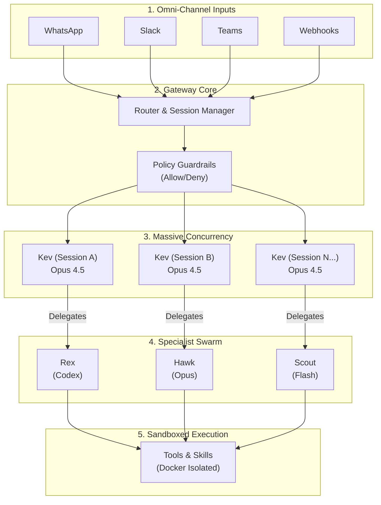
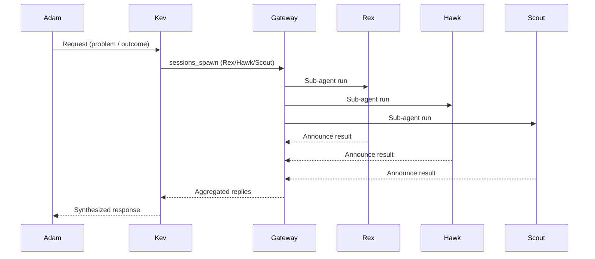

# Kev’s Dream Team: The Architecture of an AI Workforce

This is the technical companion to “2026: The Year of the Orchestrator.” It explains **how the system is wired**: models, agents, sandboxing, routing, session tools, webhooks, heartbeats, and the workflow glue that makes a multi‑agent team reliable.

Full article: https://adams-ai-journey.ghost.io/2026-the-year-of-the-orchestrator/

> **Building the future of orchestration at [thecolab.ai](https://thecolab.ai).**

> Note: configuration details are summarized and **redacted**. No secrets or tokens included.

---

## Shout‑Out (Read This First)

Massive shout‑out to https://github.com/steipete — go check his repos. He’s shipped an absurd number of great tools lately (Clawdbot, Oracle, Gog, McPorter, RepoBar, Summarize, and more). I’m a huge fan — what he’s building right now is **fucking awesome**.

---

## 0) Product Context (clawd.bot)

The clawd.bot site positions Clawdbot as “the AI that actually does things” and emphasizes:
- **Runs on your machine**: The *runtime* is local. You own the prompt loops, the memory files, and the API keys. You aren't chatting with a SaaS; you are running a private orchestration engine that rents intelligence from providers (OpenAI, Anthropic, Google) but keeps the executive function on your hardware.
- **Any chat app** front‑end (WhatsApp, Telegram, Discord, Slack, Signal, iMessage).
- **Persistent memory** that makes the assistant uniquely yours.
- **Full system access** with **sandboxing controls**.
- **Skills & plugins** — including self‑authored skills.

### Resources & Community
- **Website**: [clawd.bot](https://clawd.bot)
- **Docs**: [docs.clawd.bot](https://docs.clawd.bot/start/getting-started)
- **Discord**: [Join our Discord](https://discord.com/invite/clawd)

It also highlights a one‑line installer and 50+ integrations. This article focuses on the under‑the‑hood system that makes those claims true.

---

## 1) Architecture at a Glance

Clawdbot is a **gateway + agent runtime** system. The gateway owns:
- provider integrations (WhatsApp, Slack, Teams, etc.)
- routing and session management
- hooks and heartbeats
- tool execution (optionally sandboxed)

The agent runtime is where the LLM operates, with tool access controlled by policy. Sessions are the unit of state, and different channels map to distinct session keys.

### System Diagram (Mermaid)



---

## 2) The Roster: Kev's Dream Team

Orchestration only works if you have specialists to orchestrate. We don't ask one LLM to be a coder, designer, researcher, and ops engineer simultaneously. We split the personalities and the permissions.

### **Kev (The Orchestrator)**
- **Role:** Team Lead & Dispatcher
- **Model:** High-reasoning (e.g., Gemini 3 Pro / Claude Opus 4.5)
- **Permissions:** Full system access, session spawning, heartbeat management.
- **Vibe:** "The Manager." Kev doesn't write the code; Kev ensures the code gets written. He holds the context of the user's goals and delegates to the right specialist.

### **Rex (Engineering)**
- **Role:** Senior Software Engineer
- **Model:** Coding specialist (e.g., OpenAI Codex / Gemini Code)
- **Permissions:** Read/Write access to codebases, git operations, strict sandbox for execution.
- **Vibe:** "The Builder." Give Rex a spec, and he ships a PR.

### **Hawk (Security & QA)**
- **Role:** Security Engineer & Tester
- **Model:** Reasoning/Security focused
- **Permissions:** Read-only code access, penetration testing tools, linter execution.
- **Vibe:** "The Auditor." Hawk breaks things so users don't. He reviews Rex's PRs before they merge.

### **Scout (Research)**
- **Role:** Information Retrieval
- **Model:** High-speed web search & synthesis
- **Permissions:** Brave Search, Browser Tools, limited file access.
- **Vibe:** "The Librarian." Scout finds documentation, API specs, and competitor analysis to feed into the team's context.

### **Dash (Analytics)**
- **Role:** Data Scientist
- **Model:** Data analysis & visualization
- **Permissions:** SQL (D1/Superset), CSV processing, charting libraries.
- **Vibe:** "The Analyst." Dash turns logs into insights.

### **Dot (Ops)**
- **Role:** DevOps & Infrastructure
- **Model:** Infrastructure-as-Code specialist
- **Permissions:** Cloudflare API, AWS CLI, Terraform/Pulumi access.
- **Vibe:** "The Mechanic." Dot keeps the lights on and the pipes clean.

### **Pixel (Design)**
- **Role:** UI/UX & Creative
- **Model:** Vision-capable & Image generation
- **Permissions:** Image generation tools, frontend code access.
- **Vibe:** "The Artist." Pixel ensures it doesn't just work, but looks premium.

---

## 3) Multi‑Agent Topology

Each agent has:
- a unique workspace
- a default model
- optional per‑agent sandbox/tool rules
- optional sub‑agent permissions

The orchestrator (Kev) has full access and delegates tasks to specialists via `sessions_spawn`. Specialist agents can be locked down or sandboxed separately if needed.

Key idea: **specialization + orchestration** beats one generalist model. The config defines a roster and a routing map that binds channels/accounts to specific agent identities.

### Identity & Behavior Layers (AGENTS/SOUL/IDENTITY)

Each agent carries three human‑readable control files:
- `IDENTITY.md` — name, creature, vibe, emoji
- `SOUL.md` — behavioral rules + operating style
- `AGENTS.md` — operating contract (handoffs, safety, reporting)

This creates consistent personalities *and* consistent operational expectations across the team (e.g., “Kev is the orchestrator” and “do not message Adam directly”).

### TEAM Protocol (How Agents Coordinate)

Two shared files define how agents collaborate:
- `TEAM_PROTOCOL.md` — no‑spam rules, deliverable formats, Slack tagging discipline
- `TEAM.md` — roster, ownership matrix, escalation paths, workflows

Agents are instructed to read these every session, so handoffs stay consistent and noise stays low.

---

## 4) Models & Selection

Clawdbot supports a **model catalog** with aliases and fallbacks.

Highlights from the docs:
- `agent.models` defines an allowlist + aliases
- `agent.model.primary` chooses the default model
- `agent.model.fallbacks` adds resilience
- `agent.imageModel` can be separate if the primary lacks vision

Aliases make switching models lightweight (`/opus`, `/gemini`, etc.).

There’s also **context pruning**, which trims old tool output without deleting full transcripts — useful for long‑running agents with heavy tool usage.

### What We're Seeing Work (The "Meta")

After thousands of hours of runtime, clear winners have emerged for specific domains:

- **OpenAI Codex (GPT-5.2)**: The undisputed king of code. **Accuracy > Speed.** When Rex needs to refactor a complex class or write a test suite, Codex nails it where others hallucinate subtle bugs.
- **Claude Opus 4.5**: The best orchestrator. Kev runs on Opus because it handles long-context state and multi-step delegation better than anything else. It rarely drops the ball on protocol.
- **Gemini 3 Pro**: Excellent for frontend and visual design. Pixel uses this to nail CSS, layout, and component structures.
- **Gemini 3 Flash**: The speed demon for Scout. It's not just fast; it has a **massive context window**. Scout can ingest entire API documentation sets or long PDF reports in a single pass, distilling them into a half-page summary for the smarter (and more expensive) agents to use.

### Cost & Performance

This mix isn't just about capability; it's about economics.
- We don't burn Opus credits on summarizing search results (that's for Flash).
- We don't risk a cheap model on a production database migration script (that's for Codex).
- Orchestration allows us to **arbitrage intelligence**: paying for premium reasoning only where it moves the needle.

### Right Model for the Job

The system is designed for **model selection by task**:
- heavy reasoning/architecture → bigger models
- routine ops or summaries → cheaper/faster models
- vision tasks → image‑capable models (via `agent.imageModel`)

Aliases and allowlists make it safe to switch models without breaking policy.

---

## 5) Sandboxing & Tool Policy

Docs: https://docs.clawd.bot/gateway/sandboxing

Clawdbot can run tools inside **Docker sandboxes** to reduce blast radius.

Key controls (from `gateway/sandboxing.md`):
- `mode`: `off` | `non-main` | `all`
- `scope`: `session` | `agent` | `shared`
- `workspaceAccess`: `none` | `ro` | `rw`
- network default is **off** for sandboxes

Tools can be allow/deny‑listed globally or per agent. This makes it possible to run:
- a personal assistant with full host access
- a public agent with read‑only tools inside a sandbox

Multi‑agent precedence rules ensure **deny wins** and sandbox policies don’t override global restrictions.

---

## 6) Session Tools & Delegation

Docs: https://docs.clawd.bot/concepts/session-tool

The **session toolset** is the backbone of delegation:

- `sessions_list`: list active sessions
- `sessions_history`: fetch transcripts
- `sessions_send`: cross‑agent messaging with reply‑back
- `sessions_spawn`: run sub‑agents in parallel

From `tools/subagents.md`:
- sub‑agents run in isolated sessions
- they **announce results back** automatically
- no sub‑agent can spawn another sub‑agent
- concurrency is controlled via `agent.subagents.maxConcurrent`

This yields **fan‑out work** without blocking the main orchestrator, while keeping tool usage tightly controlled.

### Delegation Flow (Mermaid)



---

## 7) Heartbeats: Proactive Automation

Docs: https://docs.clawd.bot/gateway/heartbeat

Heartbeats are scheduled agent turns that keep the system alive:
- configurable cadence (`agent.heartbeat.every`)
- explicit prompt body
- strict response contract (`HEARTBEAT_OK` to acknowledge)

Heartbeats are ideal for reminders, inbox monitoring, and routine checks without spamming the user. They’re **first‑class**, not hacks.

### Always‑On System

Heartbeats + hooks mean the system doesn’t sleep:
- heartbeats poll for proactive work at a fixed cadence
- hooks inject new work the moment external systems fire

That creates an **always‑on orchestration layer** rather than a reactive chat bot.

---

## 8) Webhooks & Hooks

Docs: https://docs.clawd.bot/gateway/configuration#hooks

The gateway can expose `/hooks/*` endpoints to ingest external events.

Capabilities:
- `POST /hooks/wake` to trigger a heartbeat
- `POST /hooks/agent` to create an agent run
- `POST /hooks/<name>` resolved via mappings

Mappings support templating, transforms, model overrides, and delivery routing. This is how you wire email, CRM, monitoring, or internal systems into a live agent workflow.

### Webhook Example (Server Alert → Investigation → WhatsApp)

A common pattern:
1) Monitoring system sends a webhook to `/hooks/alert`
2) Hook triggers an agent run with a playbook prompt
3) Agent uses tools (e.g., `aws-cli`, logs, dashboards) to investigate
4) Kev receives a summary and escalates to WhatsApp if action is needed

This turns alerts into **proactive incident response**, not just notifications.

---

## 9) Channels & Routing

Docs: https://docs.clawd.bot/cli/channels

Bindings map channels/accounts to agents. In practice:
- WhatsApp, Slack, and Teams can all be routed to Kev
- specialist agents can have their own channel identities

This makes “AI teams across all comms” possible without losing context. Direct chats collapse into `main`, while groups get their own session keys.

---

## 10) Workspaces & Memory

Each agent has a dedicated workspace that acts as persistent memory:
- `AGENTS.md` defines behavioral rules
- `MEMORY.md` and `memory/` capture durable facts
- shared workspace paths enable cross‑agent handoffs

Treat the workspace as the **operating system for the agent**. It’s not just storage — it’s long‑term state.

### Glossary (Shared Language)

A lightweight `GLOSSARY.md` keeps terminology consistent across the team:
- internal tools (e.g., `sessions_spawn`, `clawdspace`)
- business names and contexts
- protocol terms (heartbeat, quiet hours, deliverable format)

Shared language prevents drift across agents and keeps documentation aligned.

### Self‑Healing Docs & Continuous Improvement

Agents update their own `.md` files when they learn something new:
- rules, gotchas, or best practices go into `AGENTS.md` or `SOUL.md`
- recurring decisions land in `memory.md` or daily notes
- mistakes become guardrails (documented, not forgotten)

This creates **self‑healing documentation** that compounds over time.

---

## 11) Clawdspace & Parallel Agents

Docs: https://docs.clawd.bot/multi-agent-sandbox-tools

Clawdspace provides **remote, isolated sandboxes** for agents (think “agents with their own dev boxes”).

Why it matters:
- spin up multiple agents in parallel, each with its own repo clone
- run CPU/GPU‑heavy work off your local machine
- keep tasks isolated and reproducible

**Parallel agents pattern:**
1) Create N clawdspace environments
2) Spawn N agent sessions, each bound to one environment
3) Assign independent tasks (bugs, reviews, research)
4) Merge outputs back via PRs or handoff docs

### The Vision: 100x Rex
We are building Clawdspace because we don't just want one engineer; we want a department. The goal is to spin up **100 concurrent instances of Rex**, each tackling a different ticket or microservice, all orchestrated by Kev.

This architecture decouples the agent from the user's laptop. It turns "My AI Assistant" into **"Deployable Intelligence Units."** You can drop a pre-configured team (Kev + Rex + Hawk) into a client's infrastructure, give them access to a specific repo, and let them work autonomously in a secure, sandboxed cluster.

This is how you go from “one assistant” to a **true agent swarm** without chaos.

---

## 12) GitHub‑Centric Execution

The operating model uses GitHub issues as the source of truth, and `gh` for execution:
- issues define task state and acceptance criteria
- Slack is coordination only (deliverables only, no chatter)
- deliverables are either a PR link or inline output

### GitHub Projects per Agent

For larger initiatives, each agent can own a GitHub project board:
- clear swim‑lanes per domain (engineering, ops, research)
- WIP limits per agent
- explicit handoffs between boards

This makes multi‑agent work **visible and auditable** without a single shared backlog turning into chaos.

### Tagging & Handoff Discipline

Clawdbot’s team protocol is strict:
- only `DELIVERABLE:` or `BLOCKER:` messages
- tag the orchestrator only when work is done or blocked
- no status spam

This keeps signal high and orchestration clean.

---

## 13) Walkthrough: The Life of a Ticket

Here is how a real task flows through the system:

1.  **Ingest**: Adam WhatsApps Kev: *"We need a retry mechanism on the webhook handler."*
2.  **Triage**: Kev (Opus) checks `TEAM.md`, sees this is engineering, but checks `MEMORY.md` and recalls the repo location.
3.  **Delegate**: Kev spawns **Rex** (Codex) with the task and points him to the file path.
4.  **Execution**:
    *   Rex reads the file.
    *   Rex writes a reproduction test case (fails).
    *   Rex implements the retry logic.
    *   Rex runs the test (passes).
    *   Rex commits and pushes to GitHub.
5.  **Audit**: Kev spawns **Hawk** to review the diff. Hawk checks for security issues (e.g., "did you log the retry token?").
6.  **Report**: Kev replies to Adam on WhatsApp: *"PR is up. Added exponential backoff. Hawk approved it. Link: github.com/..."*

Total human time involved: **15 seconds** (sending the message).
Total agent time: **3 minutes**.

---

## 14) Minimal Config Example (Redacted, 3‑Agent Team)

```json
{
  "agents": {
    "defaults": {
      "model": { "primary": "google-antigravity/gemini-3-pro-high" },
      "workspace": "/Users/you/agents/kev",
      "sandbox": { "mode": "non-main", "workspaceAccess": "rw", "scope": "agent" }
    },
    "list": [
      { "id": "kev", "name": "Kev", "model": "anthropic/claude-opus-4-5", "sandbox": { "mode": "off" } },
      { "id": "rex", "name": "Rex", "model": "openai-codex/gpt-5.2-codex", "sandbox": { "mode": "all" } },
      { "id": "scout", "name": "Scout", "model": "google-vertex/gemini-3-flash-preview" },
      { "id": "hawk", "name": "Hawk", "model": "anthropic/claude-opus-4-5" }
    ]
  },
  "bindings": [
    { "agentId": "kev", "match": { "channel": "whatsapp" } },
    { "agentId": "kev", "match": { "channel": "slack", "accountId": "kev" } }
  ],
  "hooks": {
    "enabled": true,
    "path": "/hooks",
    "token": "REDACTED",
    "mappings": [
      {
        "match": { "path": "alert" },
        "action": "agent",
        "sessionKey": "hook:alert:{{id}}",
        "messageTemplate": "[ALERT]\n{{details}}",
        "deliver": true
      }
    ]
  }
}
```

---

# Closing

The system isn’t magic; it’s **plumbing**.

But when that plumbing is robust—clean routing, strict tool policy, explicit delegation, proactive heartbeats, and hardened sandboxes—the magic emerges. You stop managing individual prompts and start managing a workforce.

Kev and his Dream Team aren't just a tech demo. They are the daily drivers for an entire operational workflow, proving that with the right orchestration, AI agents can be trusted with the keys to the castle.

**2026 is the year of the orchestrator.** And Kev is ready to work.
