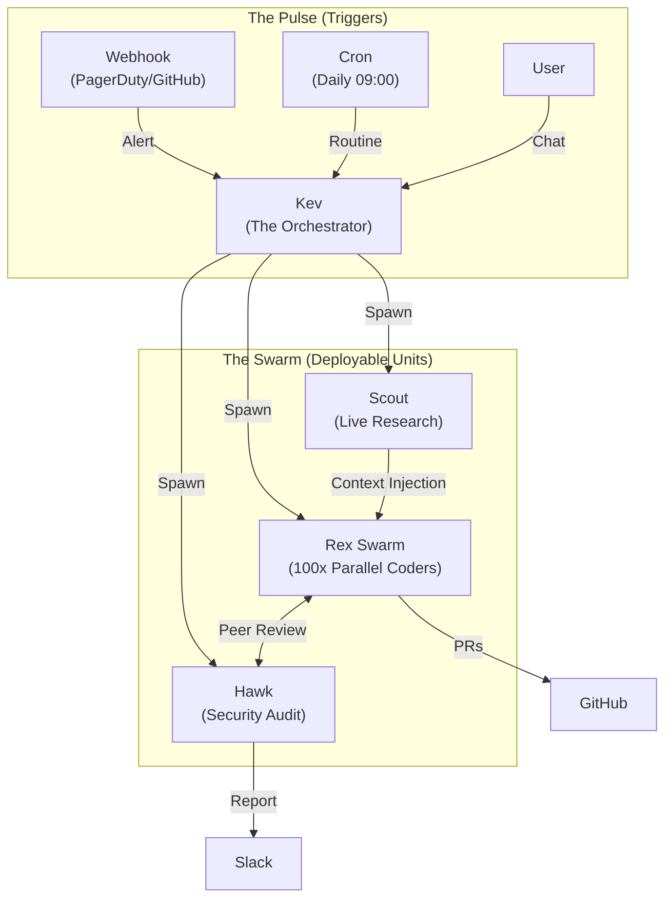

# The Orchestrator Manifesto

We are entering the post-chatbot era.

For the last few years, the industry has been obsessed with "chatting" with AI. We built better text boxes, faster streams, and polite personalities. But chatting is just an interface. **Work is the goal.**

We believe the future belongs to **Orchestrators**—systems that don't just talk, but act, delegate, and deliver.

## Our Principles

### 1. Orchestration > Chat
Chat is ephemeral; orchestration is persistent. A chatbot answers a question. An orchestrator accepts a mission, breaks it down, spawns workers, and doesn't stop until the job is done. We are building systems that manage state, not just tokens.

### 2. Specialization > Generalization
The "One Model to Rule Them All" fallacy is dead. You wouldn't ask your CTO to center a div, and you shouldn't ask your creative director to audit database security.
- **Kev** (Orchestrator) needs reasoning (Opus).
- **Rex** (Engineer) needs precision (Codex).
- **Scout** (Researcher) needs speed (Flash).
We build **teams**, not god-bots.

### 3. Local Control, Cloud Intelligence
We reject the SaaS silo. Your agent's memory, personality, and workspace should live on **your** hardware. We rent the smartest brains in the cloud (OpenAI, Anthropic, Google), but the *executive function*—the "Soul" of the agent—must be yours to own, audit, and modify.

### 4. Agents are Software
Agents aren't magic; they are software components. They need:
- **Version Control**: Git is the source of truth.
- **Testing**: Agents must be evaluated (Hawk auditing Rex).
- **CI/CD**: Deploying an agent team should be as rigorous as deploying a microservice.

We are building this future at **[thecolab.ai](https://thecolab.ai)**.

## The Future: Deployable Intelligence Units

We are moving beyond "My Personal Assistant." We are building **Deployable Intelligence Units**—living, breathing systems that scale with the work.

It's not just about one user typing a command. It's about a persistent ecosystem where:
- **Webhooks** from your production environment wake up the Ops team.
- **Cron jobs** trigger daily security audits by Hawk.
- **Orchestrators** spawn swarms of specialists to tackle massive backlogs in parallel.
- **Agents talk to agents**, passing context, code, and critiques without human bottlenecks.

Imagine a system that doesn't sleep. A security alert triggers a webhook. Kev wakes up, spawns Scout to research the CVE, spawns Hawk to audit your infrastructure, and spawns Rex to patch the vulnerability. They coordinate in a shared session, test the fix, and deploy it—all before you open your laptop.

We are decoupling intelligence from the chat box. We are turning agents into a scalable, event-driven workforce.

## Join Us

If you see this future—where AI is a team sport, where orchestration is the killer app, and where agents are trusted with the keys to the castle—we want to build with you.

This isn't just about saving time. It's about redefining what a single human can achieve.

**2026 is the year of the Orchestrator.**
