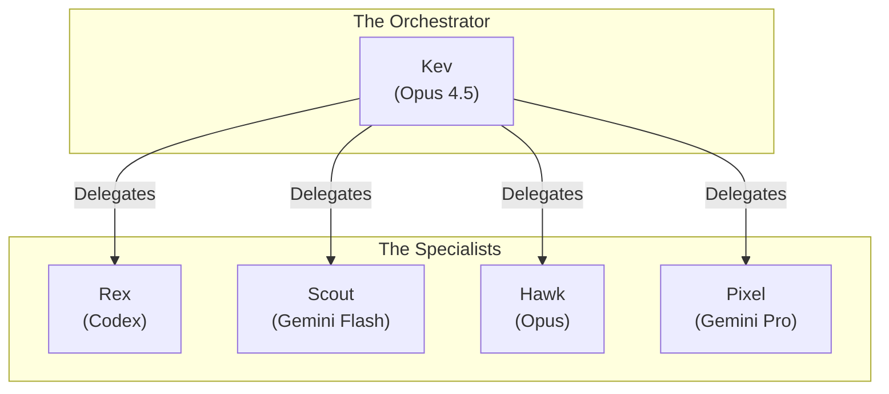

# Orchestrated AI Team — Technical Articles

Public home for technical write‑ups on orchestrated, multi‑agent AI systems.

## Contents
- [**The Manifesto**](MANIFESTO.md) — Our principles: Orchestration > Chat, Specialization > Generalization, and the future of Deployable Intelligence Units.
- [**Kev's Dream Team**](KEVS_DREAM_TEAM.md) — Technical walkthrough of the architecture (gateway, agents, sandboxing, webhooks, heartbeats, delegation, model selection).
- Public article: https://adams-ai-journey.ghost.io/2026-the-year-of-the-orchestrator/

## Why this repo
I’m publishing these as standalone articles so they can evolve independently of internal notes. Future posts and revisions will live here.

## About
Building the next generation of orchestrated AI at **[thecolab.ai](https://thecolab.ai)**.

## Contributing
PRs welcome if you have concrete improvements, corrections, or diagrams to add.

## Join the Community
- **Website**: [clawd.bot](https://clawd.bot)
- **Docs**: [docs.clawd.bot](https://docs.clawd.bot/start/getting-started)
- **Discord**: [Join our Discord](https://discord.com/invite/clawd)
- **Repo**: [clawdbot/clawdbot](https://github.com/clawdbot/clawdbot)
